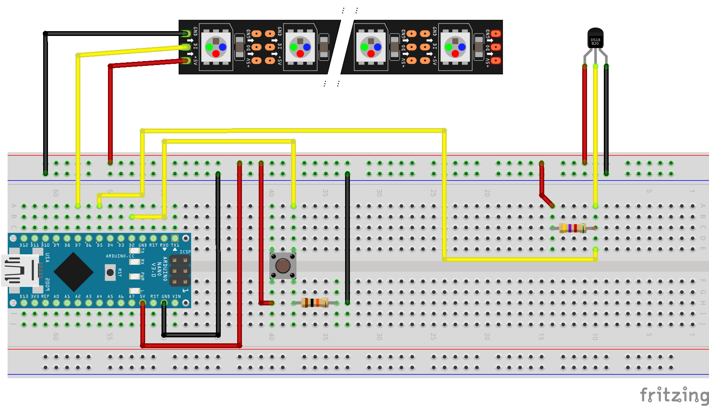

DS18B20 temperature sensor values being displayed as binary number on a WS2812 RGB LED strip.

Positive temperature readings are shown in red, negatives in blue. A binary 1 is represented
by a bright LED, a 0 by an LED at about 10% of that brightness. This makes the whole thing
more readable (or readable at all) in darkness. There are 7 LEDs leading to a range of -127°C
to 127°C which is totally sufficient for household applications. The temperature sensor is rated
for even higher temperatures but nevertheless recommended not to be used above 100°C.

A potentiometer allows adjusting LED brightness via analog input to make it fitting into ambient
illumination.

Everything is controlled by an Arduino Nano brain. YEAH!

